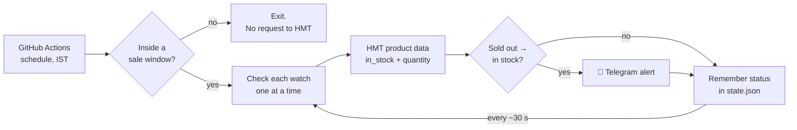

# HMT Watch Stock Monitor ⌚ → 📱

[](https://github.com/Harshan008/hmt-watch-monitor/actions/workflows/tests.yml)
[](https://github.com/Harshan008/hmt-watch-monitor/actions/workflows/monitor.yml)


Get a **Telegram alert within about 30–60 seconds of an HMT watch coming back in stock**.
Runs entirely on **free GitHub Actions**: no server, no laptop, no paid services.

```
🚨 HMT STOCK ALERT

Model: HMT Kohinoor Quartz B Maroon Sunray
Status: ✅ AVAILABLE
Detected: 10:17:32 IST
Price: ₹2,899
Link: Open product page
Source: HMT official website
```

> Personal project. Not affiliated with, endorsed by, or connected to HMT Limited.

## Contents

- [Currently watching](#currently-watching)
- [How it works](#how-it-works)
- [How fast you get alerted](#how-fast-you-get-alerted)
- [One-time setup](#one-time-setup)
- [Everyday use](#everyday-use)
- [Configuration reference](#configuration-reference)
- [Status meanings](#status-meanings)
- [Troubleshooting](#troubleshooting)
- [Honest limits](#honest-limits)
- [Development](#development)
- [Project layout](#project-layout)

## Currently watching

| Watch | Site | Price |
|---|---|---|
| HMT Kohinoor Quartz B Maroon Sunray | hmtwatches.in | ₹2,899 |
| HMT Kohinoor Automatic Maroon | hmtwatches.in | ₹11,199 |
| HMT Sangam MGSS 06 Turquoise Blue | hmtwatches.in | ₹3,299 |

The live list is always [`config/targets.yml`](config/targets.yml).

## How it works



- During the sale windows (**09:00–12:00** and **15:00–17:00 IST**) GitHub starts the monitor. It keeps
  checking until the window closes.
- For each watch it makes **one small request** for the same "quick view" data the HMT website itself uses
  (`/product_view?id=<product id>`). That data contains `in_stock` and `quantity`.
- When a watch goes **sold out → in stock**, you get **one** Telegram message.
- Outside the windows it makes **zero** requests to HMT.

It is polite by design: one request at a time, a truthful `User-Agent`, bounded timeouts, and backoff on
errors. On **403 / 429 / CAPTCHA** it **pauses** instead of trying to get around the block, and tells you
on Telegram.

### Two official HMT sites

HMT sells through two sites. Both are registered to *HMT Limited, Auxiliary Business Division, Bengaluru*
(checked via WHOIS).

| Site | Works from GitHub Actions? | Used for |
|---|---|---|
| `hmtwatches.in` | ✅ Yes | All current watches |
| `hmtwatches.store` | ❌ Blocked (403) by its firewall, which rejects cloud-server IPs | Supported in code, but only best-effort |

When a watch is listed on both, use the `.in` link. See [docs/SITE_NOTES.md](docs/SITE_NOTES.md) for the
technical details.

### Verified end to end

On 30 Sep 2026 a watch that was really in stock was added and the bot was told it had last been sold out.
The live run detected it, sent one Telegram alert, and the next run sent no duplicate.

## How fast you get alerted

| Situation | What happens |
|---|---|
| A watch restocks inside a sale window | Alert in **~30 s** when HMT's site is fast, **~60–90 s** when it's slow |
| It stays in stock | No more messages |
| It sells out and comes back | New alert, at least 10 min after the previous one |
| A different watch restocks | Its own alert straight away |
| A restock happens outside the windows | Noticed when the next window opens, if still in stock |

Checks run one watch at a time, so more watches means each one is checked a little less often when HMT is slow.

## One-time setup

1. **Telegram secrets**: repo → **Settings → Secrets and variables → Actions → New repository secret**
   - `TELEGRAM_BOT_TOKEN`: the token from @BotFather
   - `TELEGRAM_CHAT_ID`: your numeric chat id. Message **@userinfobot** in Telegram and copy the `Id`.
2. **Message your bot once**: open your bot in Telegram and send it `/start` (bots can't message you first).
3. **Test Telegram**: **Actions → HMT Stock Monitor → Run workflow → action: `test-telegram`**.
   You should get "✅ HMT monitor connected".
4. **Test the site**: run it again with **action: `check-now`**. The log shows one line per watch, like
   `CHECK target=... result=OUT_OF_STOCK`.

After that the schedule runs by itself every day.

## Everyday use

**Add a watch (no coding)**
1. Open the watch on hmtwatches.in and copy the link from the address bar.
2. **Actions → Add a watch → Run workflow**, paste the link, **Run**.
3. The bot finds HMT's product number, checks it once, and adds it to `config/targets.yml`.

**Pause a watch**: edit `config/targets.yml` on GitHub (pencil icon) and set `enabled: false`.

**Remove a watch**: delete its block from `config/targets.yml`.

**Check it's alive**: open **Actions → HMT Stock Monitor** and look at the latest run's log.

**Stop everything**: **Actions → HMT Stock Monitor → ⋯ → Disable workflow**.

## Configuration reference

All settings live in [`config/targets.yml`](config/targets.yml). Invalid settings fail with a clear error.

| Setting | Default | Meaning |
|---|---|---|
| `mode` | `near_realtime` | `near_realtime`: one long job per window. `strict_free`: one check every 5 min. |
| `interval_seconds` | `30` | Time between rounds of checks (≥ 30 in `near_realtime`, ≥ 300 in `strict_free`) |
| `active_windows` | 09:00–12:00, 15:00–17:00 | Sale windows in IST. **Also update the `cron:` lines in `.github/workflows/monitor.yml`.** |
| `request.timeout_seconds` | `60` | Max wait for HMT (it can take ~35 s) |
| `request.blocked_threshold` | `2` | Consecutive blocks before pausing a watch |
| `request.blocked_cooldown_minutes` | `30` | How long a blocked watch stays paused |
| `alerts.cooldown_minutes` | `10` | Minimum gap between two alerts for the same watch |
| `alerts.alert_possible_stock` | `true` | Alert if the data looks odd but quantity > 0 |
| `alerts.alert_blocked` | `true` | Tell you when HMT starts blocking |

Each watch (`targets:` entry) has `id`, `name`, `product_id`, `url`, `enabled`, and optionally
`site: store` for hmtwatches.store (the default is `in`).

## Status meanings

| Status | Meaning | Alert? |
|---|---|---|
| `IN_STOCK` | `in_stock` is yes and quantity > 0 | ✅ once, on the change |
| `OUT_OF_STOCK` | `in_stock` is no and quantity is 0 | no |
| `UNKNOWN` | Data missing, changed, or contradictory. **Never treated as in stock.** | "⚠️ possible stock" only if quantity > 0 |
| `BLOCKED` | 403 / 429 / challenge page. The watch pauses for 2–30 min. | "⛔ paused" once |
| `ERROR` | Timeout or server error after a retry | no, the next round tries again |

## Troubleshooting

- **No test message**: check both secrets are set and that you messaged your bot first. The run log shows
  the Telegram error (the token is never printed).
- **`result=ERROR ... Timeout`**: HMT is slow or down. Normal during busy sales. It retries next round.
- **`BLOCKED` on hmtwatches.in**: HMT is refusing requests. The bot pauses by itself. If it keeps happening,
  raise `interval_seconds` or switch to `mode: strict_free`.
- **`BLOCKED` on hmtwatches.store**: expected. That site's firewall rejects GitHub's servers. Look for the
  same watch on hmtwatches.in instead.
- **`UNKNOWN` everywhere**: HMT changed its site. `src/parser.py` needs updating.
- **"Add a watch" says 404**: HMT product links expire. Open the watch again and copy a fresh link.
- **Many "cancelled" runs in Actions**: expected. While one job is checking, later schedule ticks are
  queued and replaced.
- **Schedule stopped**: GitHub pauses schedules on inactive public repos. The *Keep schedule alive* workflow
  prevents this. If it ever happens, open **Actions → HMT Stock Monitor → Enable workflow**.

## Honest limits

- GitHub can start scheduled runs late during busy periods. Detection isn't guaranteed, and neither is buying
  the watch.
- A restock that starts and sells out outside the sale windows won't be seen.
- hmtwatches.store can't be monitored reliably from GitHub Actions (see above).
- This bot never logs in, adds to cart, buys, or bypasses CAPTCHA, rate limits or blocks.

## Development

```bash
python3 -m venv .venv && source .venv/bin/activate
pip install -r requirements.txt -r requirements-dev.txt
ruff check src tests                    # lint
python -m pytest -q                     # 92 tests, no network needed
python -m src.main --force --dry-run    # one live check, no Telegram
python -m src.add_target "<product link>"
```

Environment variables: `TELEGRAM_BOT_TOKEN`, `TELEGRAM_CHAT_ID`, `DRY_RUN=true`, `LOG_LEVEL=DEBUG`.

Every push runs lint and tests on GitHub (**Actions → Tests**). Tests use real responses saved from both
HMT sites in `tests/fixtures/`, so they never touch the network.

## Project layout

```
src/
  main.py           check loop, sale-window gate, graceful shutdown
  fetcher.py        polite HTTP: timeouts, retries, backoff, block detection
  parser.py         hmtwatches.in stock data
  store_parser.py   hmtwatches.store stock data
  detector.py       stock-change detection, no duplicate alerts, pause-on-block
  telegram.py       alert messages
  scheduler.py      IST sale windows
  config.py         loads and validates config/targets.yml
  state.py          remembers each watch's last status
  add_target.py     adds a watch from a product link
config/targets.yml  ← the only file you normally edit
state/state.json    ← updated by the bot
tests/              unit and end-to-end tests with saved HMT responses
docs/SITE_NOTES.md  how HMT's two sites expose stock (for maintainers)
.github/workflows/  monitor · add-watch · keepalive · tests
```

See [CHANGELOG.md](CHANGELOG.md) for history and [SECURITY.md](SECURITY.md) for how secrets are handled.
